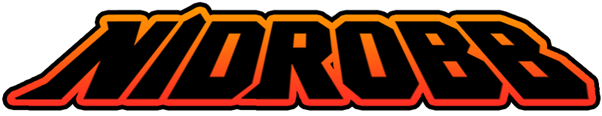
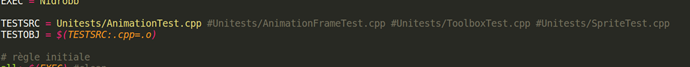
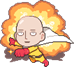
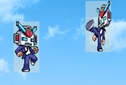
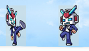
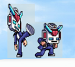
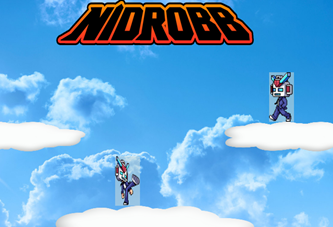
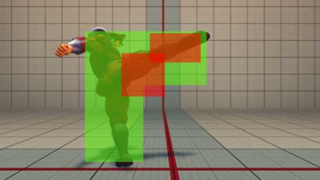

**Compte-Rendu Projet C++**

Harlé Antoine - Hanna Élias

**Sommaire**

**[Getting started](#getting-started) 2**

**[How to play](#how-to-play) 2**

**[Description du projet](#description-du-projet) 3**

**[Organisation](#organisation) 4**

**Getting started**
===================

***Prérequis :*** C++ 11 , SDL2, Boost.test

***Lancement de Nidrobb :***

-   Lancer la commande *make* à la racine du fichier *src* pour compiler les fichiers sources.

-   Lancer la commande *./Nidrobb*.

***Lancement des tests unitaires :***

-   Choix du test de classe à lancer : dans le fichier *makefile* à la racine du fichier *src*, choisir [un]{.ul} test à réaliser parmis les tests disponible en commentaire (\#Unitests/TestDispo.cpp) en le plaçant non commenté devant *TESTSRC =* .

-   Lancer la commande *make Unitest* à la racine du fichier *src* afin de compiler et lancer le test.

**How to play**
===============

**But du jeu :**

(*But initial*) Tuer le joueur adverse et progresser dans la zone du
joueur adverse.

(*But actuel*) Toucher le joueur adverse en premier.

**Mécanique de jeu :**

-   *One Punch Man* : Un coup suffit à mettre au tapis ton adversaire !

-   *Du fun en illimité !* : Respawn des joueurs tués instantané.

-   *Combat aériens* : Possibilité de se battre dans les airs ! Après avoir pris un peu de hauteur, court et bat toi dans les air tel Son Goku©️ !

-   *Parade* : Possibilité de contrer une attaque adverse avec une attaque au bon moment !

-   *Esquive* : Possibilité d\'esquiver une attaque en s'accroupissant au bon moment !

**Commandes :**

-   **Déplacement :**

    -   J1 : Q / D

    -   J2 : ← / →

-   **Accroupis :**

    -   J1 : S

    -   J2 : ↓

-   **Sauts :**

    -   J1 : Barre Espace

    -   J2 : Enter (Pavé numérique)

-   **Attaque :**

    -   J1 : G

    -   J2 : 0 (Pavé Numérique)

**Description du projet**
=========================

Le jeu est basée sur les animations et a pour objectif de faciliter
l'ajout/amélioration de contenu.

**Réalisations :**

-   Affichage

-   Gestion des entrées utilisateurs flexible : *InputMap, CommandPattern*

-   Mouvements simples

-   Animations flexible : Modification simple des animations (Sprite, Hitbox Passive/Active) dans l'*AnimationBuilder*.

-   Monde flexible : Modification simple des environnements (fond, plateforme, obstacles) dans le *WorldBuilder*.

-   Ajout simple de joueurs ordinateurs.

**Bug :**

-   *Gestion des fuites mémoires impossible* : Lancement de *valgrind* avec Nidrobb échoue systématiquement.

-   Bugs de collisions : sortie de la carte, saut sur obstacles

-   Bug de chute : pas de chute tant qu'il y a des actions.

**Améliorations :**

-   Menu de jeu!

-   Tests complets et unifiés

-   Postures de joueurs (haute/milieu/basse)

-   Attaques haute / basses

-   Animations de morts

-   Raffinement des frames (Sprites & Hitbox Passive/Active)

-   Affichage des hitbox Passive / Active

**Inspirations du système de hitbox
:**

**Hitbox passive** = réception de dommages / collisions environnement

**Hitbox active** = envoie de dommage / parades

**Organisation**
================

Pour commencer, nous nous sommes répartis les rôles comme suit :

-   Harlé Antoine : Responsable Mécanique de jeu

-   Hanna Elias : Responsable Graphique

Pour le développement, nous avons commencés par définir nos objectifs à
court et long termes puis avons commencé à produire un premier UML sur
lequel se baser.

Nous nous sommes servis de Google Drive pour la mise en commun des
données. L'utilisation d'un git semblant peu pertinent pour un projet de
cet ampleur et durée.

A partir de cela, nous tentions de modifier le moins possible les mêmes
fichiers afin de faciliter la mise en commun.

Travail réalisé :

-   Harlé Antoine

\- Rédaction du README

\- Gestion de l'UML

\- Gestion des tests unitaires : *Unitests*

\- Mise en place des Design Pattern (Command Pattern, Singleton,
Factory)

\- Développement des animations : *AnimationFrame, Animation,
AnimationBuilder, (sprite)*

\- Gestion des graphiques : images joueurs, obstacles, etc.

*-* Gestion des entrées : *InputMap, Command, RightCommand*, etc.

-Toolbox

\- Structure de jeu : Game, *Player, Obstacle, World, WorldBuilder*

*-* Gestion des collisions (Passive/Active)

\- Gestion des chutes V2 (isFallingV2)

\- Fréquence d'affichage

-   Hanna Elias

\- Gestion de l'affichage : *display, window, sprite*

\- Gestion des chutes (isFalling)

\- Toolbox
